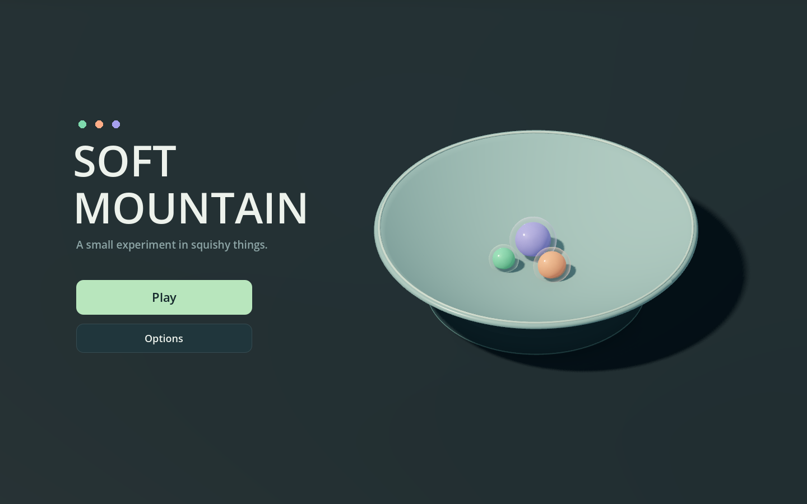
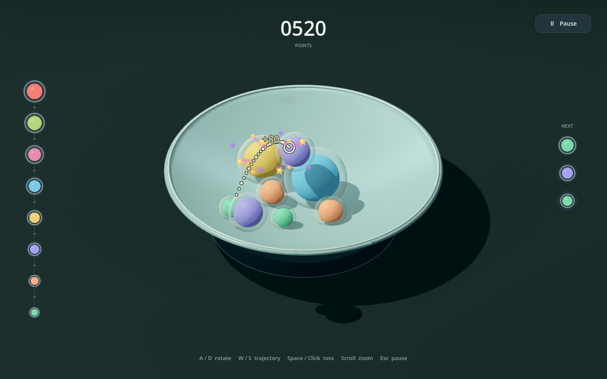
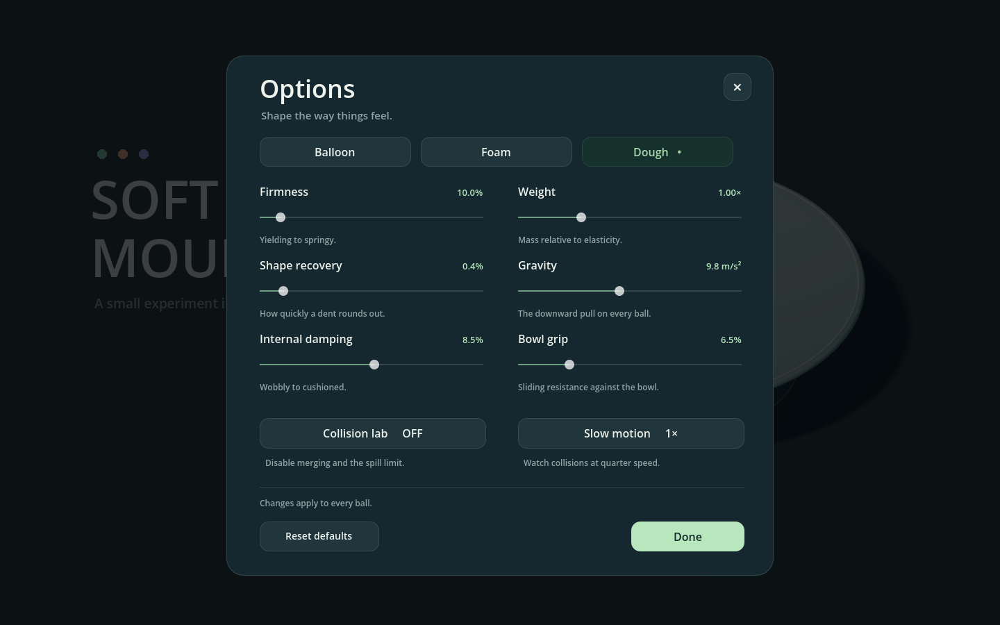
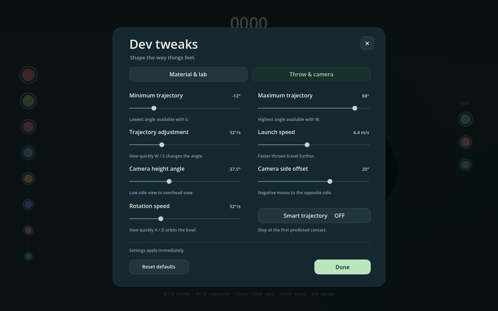

# Soft Mountain

A playable Godot prototype about tossing soft coloured cells into a ceramic bowl. Each has a translucent membrane around a solid coloured core. Matching tiers merge; different tiers compress, wobble, and push each other. No fruit, imported art, paid assets, or addons.





## Browser version

[Play Soft Mountain in your browser](https://adam-vozzo.github.io/game16/). Use a desktop browser with a keyboard and mouse; touch controls are not implemented.

The exported game is checked into `docs/`. GitHub Pages uses **Settings → Pages → Deploy from a branch → main → /docs**. To update it, run `scripts/export_web.ps1 -GodotPath "C:\path\to\godot.exe"` with matching web export templates installed, then commit the generated `docs/index.*` files and push `main`. Pages publishes those files automatically; source changes need a fresh export first.

The **Web** export preset writes `build/web/index.html` and its companion files. Keep all exported files together. For local testing, serve that folder over HTTP (for example, `python -m http.server 8765 --directory build/web`) and open `http://localhost:8765/`; opening the HTML directly from disk will not work. A ready-to-upload local package is `build/SoftMountain-Web.zip`.

Web uses Godot's Compatibility renderer and a single-threaded export, so it runs on static hosting without special cross-origin headers. Desktop uses Forward+; the Compatibility lighting is tuned separately to keep the bowl close to the desktop brightness. The cell layers and soft-body simulation are shared by both builds. The first visit downloads the WebAssembly engine, and crowded bowls may run slower on weaker devices.

## Play

Open `project.godot` in **Godot 4.6+** and press **F5**. The regular Godot build is sufficient; no C# or .NET is required. Forward+ is the default renderer. For an older GPU, launch with `--rendering-method gl_compatibility` (lighting differs).

A local standalone Windows build is available at `build/SoftMountain.exe` after exporting the **Windows Desktop** preset. Builds are excluded from source control. The prototype was developed and tested with Godot 4.6.1; the local executable is exported with the installed Godot 4.7.2 templates.

The main menu offers **Play** and **Options**. Play starts a bowl with three different tiers. Rotate around the bowl with A/D, raise or lower the throw angle with W/S, then click or press Space to toss immediately. Mouse position and hold duration do not affect the throw. The camera views the throw from a slight side angle to keep its arc readable as you orbit. The outlined dotted arc stops at the first predicted contact with the current pile or bowl. It uses the thrown ball's shell size, the deformed target cages, and the solver's airborne timestep. A short lead-in connects the center path to a marker on the contact surface. Balls hide the parts of the guide behind them, and crowded dots share one outside outline. This is a snapshot estimate: it does not simulate the pile's future movement, post-impact deformation, or bounces. Same-tier contact creates the next larger tier and awards points, which float up from the merge and fade away alongside a burst of yellow stars with pink and purple trails. The eight tiers approximately double in volume at each merge. Tier 8 stays in play and cannot merge further. A ball that escapes the bowl ends the round.

| Input | Action |
| --- | --- |
| Click or Space | Throw once, immediately |
| A / D, left / right arrows | Orbit the bowl and throwing position |
| W / S, up / down arrows | Raise / lower the throw trajectory |
| Wheel | Zoom |
| P / Escape | Pause/resume; close Options back to its parent menu |
| Pause → New bowl | Confirm before resetting the current round |
| Pause → Options | Material, lab, throw, and camera tuning |

**Dough is the default material.** The same Options modal is available from the main menu and Pause. It includes Balloon/Foam/Dough presets, firmness, shape recovery, internal damping, **weight**, **gravity**, and **bowl grip**, plus **rotation speed** (15–150°/s), collision lab, and quarter-speed simulation. Material settings apply to **all existing and new balls** immediately and persist between rounds for the current session. Reset defaults restores dough, normal simulation speed, 52°/s rotation, and the standard game rules. Collision lab disables merging and spill loss, and allows up to 44 balls.

Weight changes mass and the response of the elastic constraints, so greater weight compresses further under the same gravity. It does not make a freely falling ball accelerate faster. Gravity independently adjusts downward acceleration; bowl grip affects sliding resistance against the bowl. These are artistic development controls, not calibrated physical units for a particular real material.

Pause, Options, and the New bowl confirmation freeze physics and block gameplay input. New bowl warns that the current score and balls will be cleared; Cancel or Escape keeps the round intact. Closing Options returns to the menu that opened it. In gameplay, score is centered at the top, the tier ladder ascends along the left, and upcoming throws sit on the right; controls stay at the bottom.

Options has two tabs. **Material & lab** contains the soft-body controls. **Throw & camera** adds minimum/maximum trajectory angles (within −35° to 80°, with at least a 5° gap), trajectory adjustment speed (5–100°/s), launch speed (2–12 m/s), camera height angle (20–70°), camera side offset (−65° to 65°), and rotation speed. Launch speed changes flight distance; W/S operates within the selected angle range. Camera settings affect the view without steering the shot. All settings persist between bowls for the current session and can be restored with Reset defaults.





## Soft-body implementation

This is a custom position-based solver in GDScript, rather than `SoftBody3D`. Jolt does not currently implement soft-body-to-soft-body collision response ([upstream architecture](https://github.com/jrouwe/JoltPhysics/blob/master/Docs/Architecture.md#soft-body-wip)).

Each ball has a welded icosphere cage of 42 moving particles, 120 structural edges, and 80 oriented faces. At 180 substeps per second, distance constraints resist stretching, a closed-mesh signed-volume constraint preserves bulk, and gentle rotation-independent radial recovery encourages a spherical resting shape. Internal velocity damping controls wobble without stopping the whole body's translation. Contact corrects patches of actual shell particles on both bodies, balanced by mass, so deformation changes how a pile settles. The bowl also collides with individual particles using the same analytic profile as its rendered mesh.

The rendered surface subdivides the cage into 642 vertices and 1,280 smooth-shaded triangles. It follows the simulated particles, with a small curved edge interpolation. Two instances share this deformed mesh: a glossy translucent membrane at full size and an opaque, softly textured core at 76% scale. The core is purely visual and adds no rigid collider; the membrane remains the contact surface. Transparency is an artistic approximation rather than optical refraction. It is not a scaled rigid sphere or a shader-only squash effect. Slow motion advances the same fixed steps less frequently, preserving the material settings.

**Prototype limits:** contact normals are approximated using the centers of two convex sphere-like bodies; this is not a general solver for concave meshes or cloth. There is no self-collision, tearing, liquid simulation, or plastic deformation. Extremely crowded/deeply intersecting configurations may need more resolution or a native solver. The 44-body cap bounds CPU work. The material presets are artistic approximations, not calibrated physical materials. No high-score persistence, multiplayer, or final art is included.

## Files

- `scripts/soft_ball.gd` — particle state, constraints, surface rendering.
- `scripts/soft_simulation.gd` — fixed steps, bowl and pair contacts, merging, escape detection.
- `scripts/soft_geometry.gd` — procedural cage and bowl.
- `scripts/main.gd` — input, throws, camera, lighting, effects and sound.
- `scripts/hud.gd` — interface and live tuning.
- `scripts/aim_preview.gd` — first-contact prediction and deformed-shell occlusion.
- `shaders/cell_shell.gdshader` and `cell_core.gdshader` — transparent membrane and solid core materials.
- `tests/physics_tests.gd` — deterministic simulation regressions.
- `tests/merge_tests.gd` — merge stability regressions.
- `tests/ui_tests.gd` — menu navigation, input isolation, score popups, and material tuning.

All geometry and sound are generated in Godot, making the prototype easy to change without a Blender or Aseprite asset pipeline.

## Validate

```sh
godot --headless --path . --editor --import --quit
godot --headless --path . --script res://tests/physics_tests.gd
godot --headless --path . --script res://tests/merge_tests.gd
godot --headless --path . --script res://tests/ui_tests.gd
godot --headless --path . --script res://tests/aim_tests.gd
```

Tests cover resting shape, impact deformation and recovery, volume, mixed-tier collision, two- and three-way merges, the terminal tier, stack stability, timestep changes, escape detection, and clearing the world. Merge regressions cover grounded merges across all presets, crowded contacts, inherited airborne movement, and expiry of the settling guard.

For 0.5 seconds after a merge, the child and its immediate contact neighbours receive a kinetic-energy guard. Position corrections still separate overlapping geometry and recover shape, but cannot add translational or internal kinetic energy above that supplied by integration. This intentionally softens impacts near a newborn body, preventing a larger shell intersecting the bowl or the pile from becoming an explosive impulse. Genuine inherited travel is retained; the guard expires in simulation time, including in slow motion.

For an unattended visual smoke test:

```sh
godot --path . -- --demo --capture-frame=1800
godot --path . -- --capture-frame=60 --capture-name=menu
godot --path . -- --options --capture-frame=60 --capture-name=options
```

This throws automatically, writes `captures/prototype.png`, then exits. `--demo` is a developer aid, not part of normal play.
