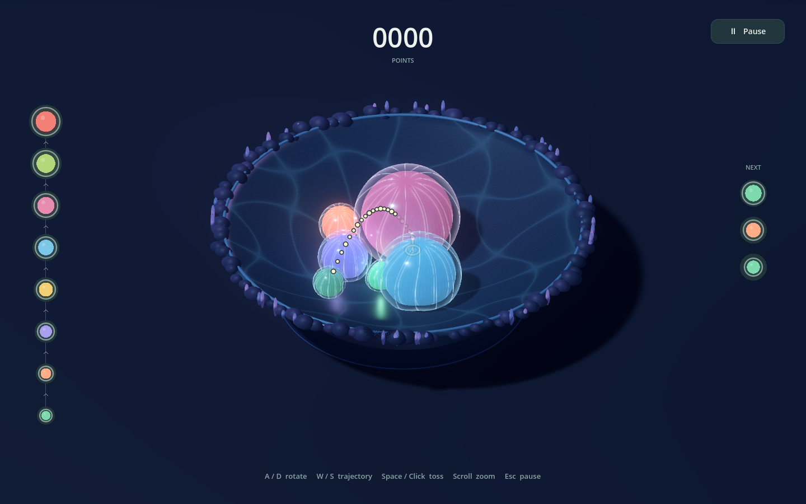
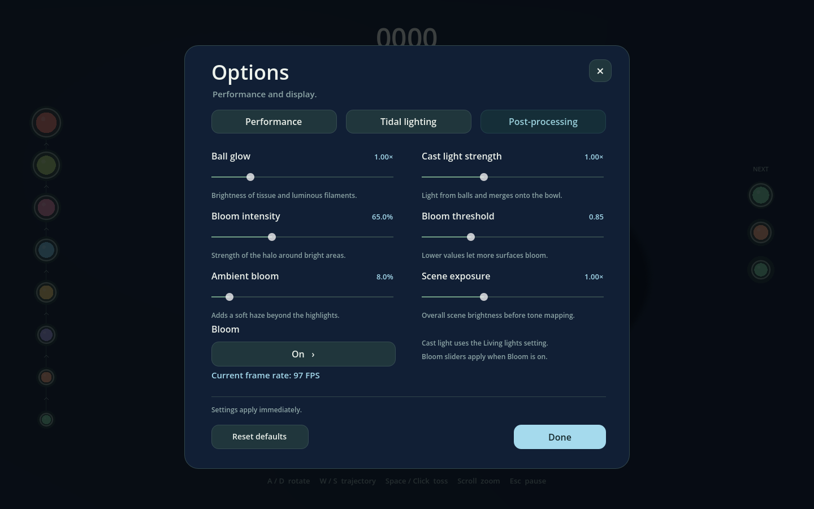
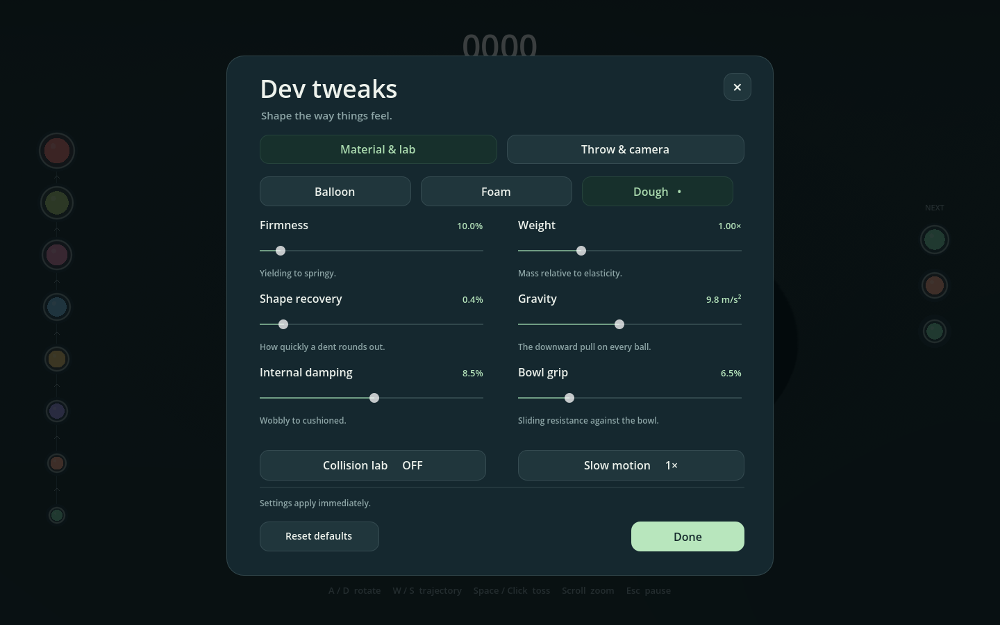
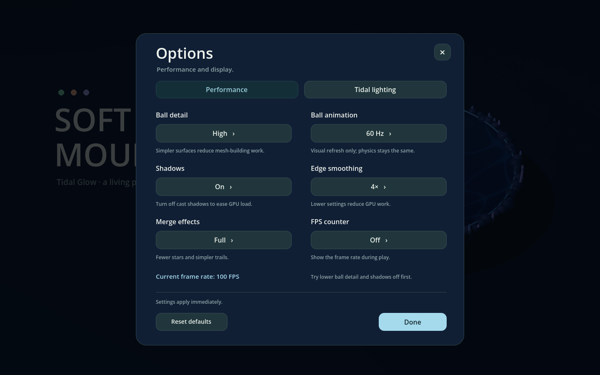

# Soft Mountain

A playable Godot prototype about tossing jellyfish-like soft cells into a glowing tidal pool. Each has a translucent membrane, luminous canals, and coloured inner tissue. Matching tiers merge; different tiers compress, wobble, and push each other. No fruit, imported art, paid assets, or addons.


## Browser version

[Play Soft Mountain in your browser](https://adam-vozzo.github.io/game16/). Use a desktop browser with a keyboard and mouse; touch controls are not implemented.

The exported game is checked into `docs/`. GitHub Pages uses **Settings → Pages → Deploy from a branch → main → /docs**. To update it, run `scripts/export_web.ps1 -GodotPath "C:\path\to\godot.exe"` with matching web export templates installed, then commit the generated `docs/index.*` files and push `main`. Pages publishes those files automatically; source changes need a fresh export first.

The **Web** export preset writes `build/web/index.html` and its companion files. Keep all exported files together. For local testing, serve that folder over HTTP (for example, `python -m http.server 8765 --directory build/web`) and open `http://localhost:8765/`; opening the HTML directly from disk will not work. A ready-to-upload local package is `build/SoftMountain-Web.zip`.

Web uses Godot's Compatibility renderer and a single-threaded export, so it runs on static hosting without special cross-origin headers. Desktop uses Forward+; the Compatibility lighting is tuned separately to keep the bowl close to the desktop brightness. The cell layers and soft-body simulation are shared by both builds. The first visit downloads the WebAssembly engine, and crowded bowls may run slower on weaker devices.

## Tidal Glow experiment

The separate local Windows build is `build/SoftMountain-TidalGlow-Lighting.exe`. It uses Forward+ with real screen-space subsurface scattering on the opaque inner tissue, transmittance, and HDR bloom. **Options → Tidal lighting** controls living lights and scattering. **Options → Post-processing** adds ball glow (0–5×), cast light strength (0–3×), bloom on/off, bloom intensity (0–200%), bloom threshold (0.1–3), ambient bloom (0–100%), and scene exposure (0.5–2×). Settings apply immediately and persist between bowls for the session; Reset defaults restores them. Ball glow changes tissue and filament emission, while cast light strength controls illumination of the bowl and nearby cells, including merge flashes. Godot only implements subsurface scattering in Forward+ ([documentation](https://docs.godotengine.org/en/stable/tutorials/3d/standard_material_3d.html#subsurface-scattering)).

The browser build uses the same membrane, filaments, tier colours and physics, with backlighting as a cheaper tissue approximation. Scattering, bloom, and exposure controls are disabled there; ball glow and cast light strength remain adjustable. Desktop Full lighting has 46 slots: enough for all 44 balls and two simultaneous merge flashes, so low-tier cells keep their lights even in a full bowl. Desktop Reduced uses 16 lights. Browser Full remains capped at four lights, with two on Reduced (the browser default). Reduced budgets prioritize larger cells and merge flashes. These point lights do not cast additional shadows. Living lights Off retains the emissive filament pattern.

Filaments use coordinates attached to the undeformed cage, so they stretch with the actual simulated tissue. Their travelling light pulses and the stylized caustic pattern on the bowl freeze with Pause and follow slow motion. The caustics are a procedural material effect, not a fluid or optical simulation. The dark rock rim and small coral shapes use two static instanced meshes, with no added collision geometry. No refraction, volumetric water or real-time global illumination is implied by the translucent look.



Validation includes fixed light budgets, effect expiry, pause behaviour, deformation coordinates, platform capability controls and an actual Forward+ scattering on/off image comparison. The render comparison also checks that turning scattering off leaves valid lit tissue and verifies that every post-processing slider changes the rendered pixels. A full 44-ball pile with two simultaneous merges is tested for light coverage.



## Play

Open `project.godot` in **Godot 4.6+** and press **F5**. The regular Godot build is sufficient; no C# or .NET is required. Forward+ is the default renderer. For an older GPU, launch with `--rendering-method gl_compatibility` (lighting differs).

A local standalone Windows build is available at `build/SoftMountain.exe` after exporting the **Windows Desktop** preset. Builds are excluded from source control. The prototype was developed and tested with Godot 4.6.1; the local executable is exported with the installed Godot 4.7.2 templates.

The main menu offers **Play** and **Options**. Play starts a bowl with three different tiers. Rotate around the bowl with A/D, raise or lower the throw angle with W/S, then click or press Space to toss immediately. Mouse position and hold duration do not affect the throw. The camera views the throw from a slight side angle to keep its arc readable as you orbit. The outlined dotted arc continues through the pile to the bowl by default. Sections inside or behind balls fade to 18% opacity, and crowded dots share one outside outline without opacity building up. Enable **Smart trajectory** in **Pause → Dev tweaks → Throw & camera** to stop at the first predicted ball contact instead. Smart mode uses the thrown shell size and deformed target cages, with a marker on the contact surface; it is a snapshot estimate that does not simulate the pile's future movement or bounces. Same-tier contact creates the next larger tier and awards points, which float up from the merge and fade away alongside a burst of yellow stars with pink and purple trails. The eight tiers approximately double in volume at each merge. Tier 8 stays in play and cannot merge further. A ball that escapes the bowl ends the round.

| Input | Action |
| --- | --- |
| Click or Space | Throw once, immediately |
| A / D, left / right arrows | Orbit the bowl and throwing position |
| W / S, up / down arrows | Raise / lower the throw trajectory |
| Wheel | Zoom |
| P / Escape | Pause/resume; close Options or Dev tweaks back to its parent menu |
| Pause → New bowl | Confirm before resetting the current round |
| Pause → Options | Performance and display settings |
| Pause → Dev tweaks | Material, lab, throw, and camera tuning |

**Dough is the default material.** Development controls live in **Pause → Dev tweaks**, separate from Options. This modal includes Balloon/Foam/Dough presets, firmness, shape recovery, internal damping, **weight**, **gravity**, and **bowl grip**, plus **rotation speed** (15–150°/s), collision lab, and quarter-speed simulation. Material settings apply to **all existing and new balls** immediately and persist between rounds for the current session. Reset defaults restores dough, normal simulation speed, 52°/s rotation, and the standard game rules. Collision lab disables merging and spill loss, and allows up to 44 balls.

Weight changes mass and the response of the elastic constraints, so greater weight compresses further under the same gravity. It does not make a freely falling ball accelerate faster. Gravity independently adjusts downward acceleration; bowl grip affects sliding resistance against the bowl. These are artistic development controls, not calibrated physical units for a particular real material.

Pause, Options, Dev tweaks, and the New bowl confirmation freeze physics and block gameplay input. New bowl warns that the current score and balls will be cleared; Cancel or Escape keeps the round intact. Closing Options returns to the menu that opened it. Closing Dev tweaks returns to Pause. Reset defaults resets only the settings in the current menu. In gameplay, score is centered at the top, the tier ladder ascends along the left, and upcoming throws sit on the right; controls stay at the bottom.

**Dev tweaks** has two tabs. **Material & lab** contains the soft-body controls. **Throw & camera** adds minimum/maximum trajectory angles (within −35° to 80°, with at least a 5° gap), trajectory adjustment speed (5–100°/s), launch speed (2–12 m/s), camera height angle (20–70°), camera side offset (−65° to 65°), rotation speed, and the Smart trajectory toggle (off by default). Launch speed changes flight distance; W/S operates within the selected angle range. Camera settings affect the view without steering the shot. All settings persist between bowls for the current session and can be restored with Reset defaults.




**Options** is available from the main menu and Pause, and provides performance controls: ball detail (Low / Medium / High), ball animation refresh (30 Hz / 60 Hz / every frame), shadows, edge smoothing (Off / 2× / 4×), merge effects (Off / Reduced / Full), and an optional gameplay FPS counter. Defaults retain High detail, 60 Hz animation, shadows, 4× smoothing and Full effects. Settings apply immediately to existing and new balls and persist between bowls for the session. Start with lower ball detail and shadows off on slower devices. The FPS reading inside Options measures the paused menu; enable the gameplay counter to compare performance during play.

Low, Medium and High meshes use 42 / 162 / 642 vertices and 80 / 320 / 1,280 triangles per layer. Animation refresh limits CPU mesh rebuilding without changing the 180 Hz physics solver, collisions, or merging. Unchanged paused meshes are not rebuilt. Reduced effects use six stars without trails; Off retains floating score feedback. These controls reduce rendering work, but a crowded bowl can still be limited by the GDScript physics solver.



## Soft-body implementation

This is a custom position-based solver in GDScript, rather than `SoftBody3D`. Jolt does not currently implement soft-body-to-soft-body collision response ([upstream architecture](https://github.com/jrouwe/JoltPhysics/blob/master/Docs/Architecture.md#soft-body-wip)).

Each ball has a welded icosphere cage of 42 moving particles, 120 structural edges, and 80 oriented faces. At 180 substeps per second, distance constraints resist stretching, a closed-mesh signed-volume constraint preserves bulk, and gentle rotation-independent radial recovery encourages a spherical resting shape. Internal velocity damping controls wobble without stopping the whole body's translation. Contact corrects patches of actual shell particles on both bodies, balanced by mass, so deformation changes how a pile settles. The bowl also collides with individual particles using the same analytic profile as its rendered mesh.

The rendered surface subdivides the cage into 642 vertices and 1,280 smooth-shaded triangles. It follows the simulated particles, with a small curved edge interpolation. Two instances share this deformed mesh: a glossy translucent membrane at full size and an opaque, softly scattering inner tissue at 86% scale. The core is purely visual and adds no rigid collider; the membrane remains the contact surface. Transparency is an artistic approximation rather than optical refraction. It is not a scaled rigid sphere or a shader-only squash effect. Slow motion advances the same fixed steps less frequently, preserving the material settings.

**Prototype limits:** contact normals are approximated using the centers of two convex sphere-like bodies; this is not a general solver for concave meshes or cloth. There is no self-collision, tearing, liquid simulation, or plastic deformation. Extremely crowded/deeply intersecting configurations may need more resolution or a native solver. The 44-body cap bounds CPU work. The material presets are artistic approximations, not calibrated physical materials. No high-score persistence, multiplayer, or final art is included.

## Files

- `scripts/soft_ball.gd` — particle state, constraints, surface rendering.
- `scripts/soft_simulation.gd` — fixed steps, bowl and pair contacts, merging, escape detection.
- `scripts/soft_geometry.gd` — procedural cage and bowl.
- `scripts/main.gd` — input, throws, camera, lighting, effects and sound.
- `scripts/hud.gd` — interface and live tuning.
- `scripts/aim_preview.gd` — first-contact prediction and deformed-shell occlusion.
- `shaders/cell_shell.gdshader` and `cell_core.gdshader` — transparent membrane and solid core materials.
- `tests/physics_tests.gd` — deterministic simulation regressions.
- `tests/merge_tests.gd` — merge stability regressions.
- `tests/ui_tests.gd` — menu navigation, input isolation, score popups, and material tuning.

All geometry and sound are generated in Godot, making the prototype easy to change without a Blender or Aseprite asset pipeline.

## Validate

```sh
godot --headless --path . --editor --import --quit
godot --headless --path . --script res://tests/physics_tests.gd
godot --headless --path . --script res://tests/merge_tests.gd
godot --headless --path . --script res://tests/ui_tests.gd
godot --headless --path . --script res://tests/aim_tests.gd
godot --headless --path . --script res://tests/performance_tests.gd
godot --headless --path . --script res://tests/tidal_tests.gd
godot --path . --rendering-method forward_plus --script res://tests/tidal_render_tests.gd
```

Tests cover resting shape, impact deformation and recovery, volume, mixed-tier collision, two- and three-way merges, the terminal tier, stack stability, timestep changes, escape detection, and clearing the world. Merge regressions cover grounded merges across all presets, crowded contacts, inherited airborne movement, and expiry of the settling guard.

For 0.5 seconds after a merge, the child and its immediate contact neighbours receive a kinetic-energy guard. Position corrections still separate overlapping geometry and recover shape, but cannot add translational or internal kinetic energy above that supplied by integration. This intentionally softens impacts near a newborn body, preventing a larger shell intersecting the bowl or the pile from becoming an explosive impulse. Genuine inherited travel is retained; the guard expires in simulation time, including in slow motion.

For an unattended visual smoke test:

```sh
godot --path . -- --demo --capture-frame=1800
godot --path . -- --capture-frame=60 --capture-name=menu
godot --path . -- --options --capture-frame=60 --capture-name=options
```

This throws automatically, writes `captures/prototype.png`, then exits. `--demo` is a developer aid, not part of normal play.
